# TimeGuard 时间管家 ⏳

[](https://github.com/31874951687/TimeGuard/actions/workflows/tests.yml)
[](LICENSE)


> 常驻 Windows 后台的**游戏 / 网页使用时长监控 + 待办任务管理**工具：达到每日上限后用右下角通知 + 置顶弹窗强制提醒你休息，开机时用鼓励语提醒你今天要做的事，并用 7 天柱状图让你看见时间去了哪里。

专为"无意识刷视频 / 打游戏"场景设计：只在被监控的程序处于**前台活跃**时计时，切走、最小化、锁屏、休眠都会自动暂停。

## 界面预览

| 主界面（实时状态） | 数据统计（图表 + 明细表，可拖拽分配高度） |
| --- | --- |
| 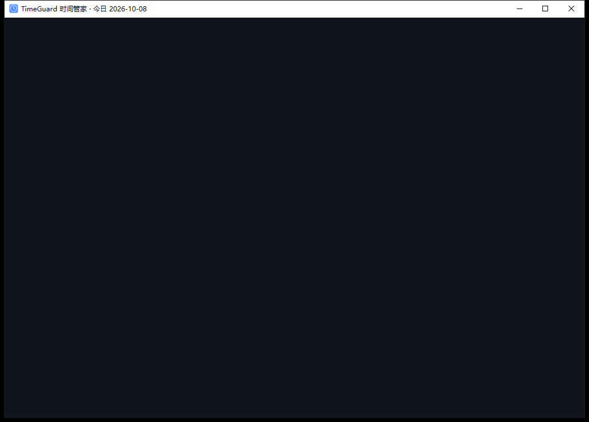 | 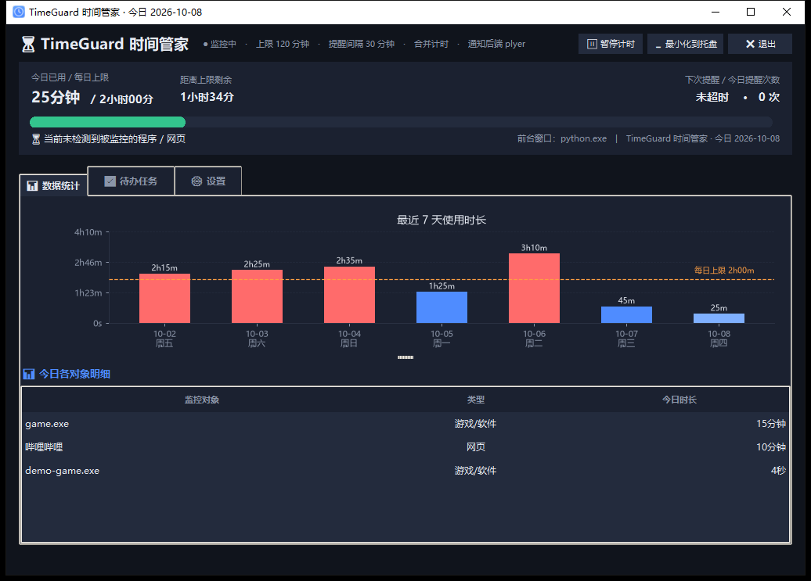 |

| 待办任务（今日 / 本周分组 + 周期任务打卡） | 开机待办提醒弹窗 |
| --- | --- |
| 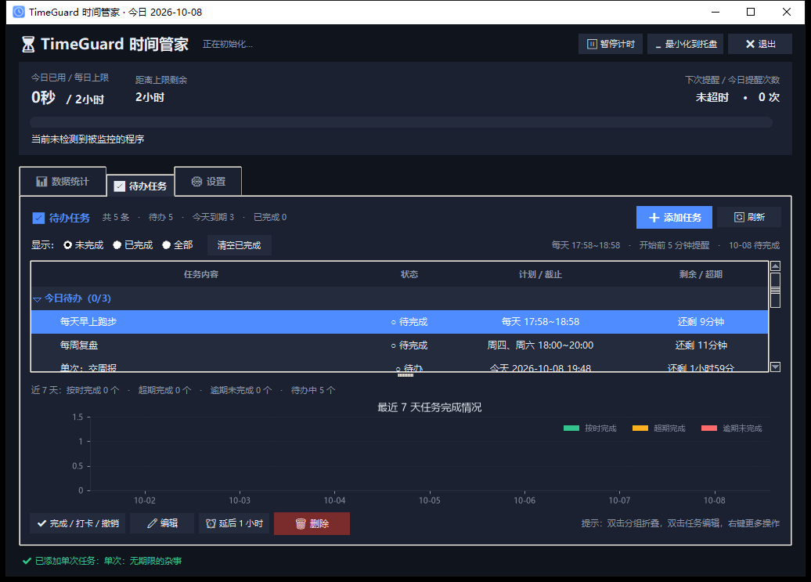 | 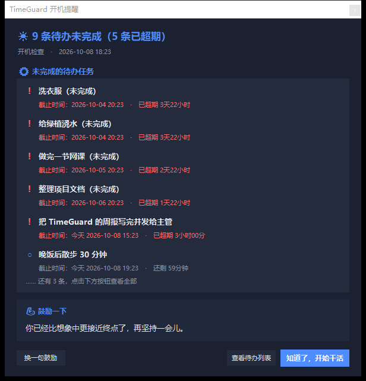 |

| 添加任务（单次：日历式日期时间选择） | 周期任务：每天（时间段 + 提前提醒） |
| --- | --- |
| 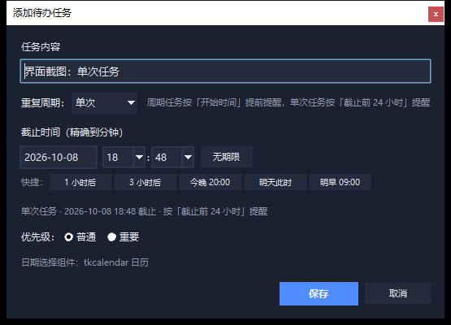 | 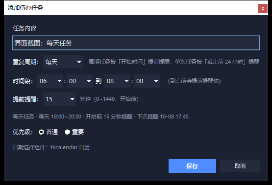 |

| 周期任务：每周（多选星期几） | 周期任务提醒（同一刻多项合并成一个窗） |
| --- | --- |
| 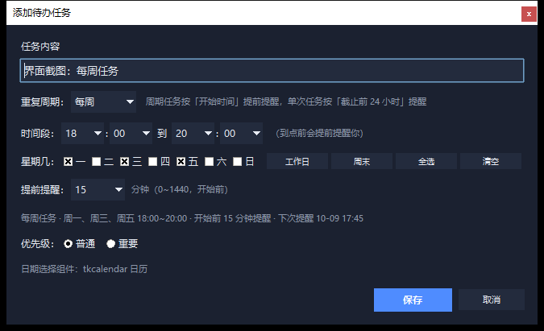 | 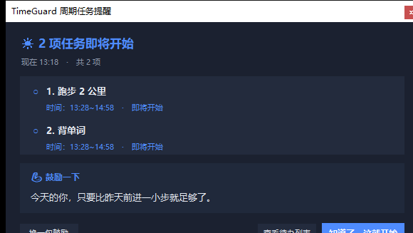 |

| 窗口大小设置 + 实时预览 | 自定义窗口尺寸后的效果（1180×700） |
| --- | --- |
| 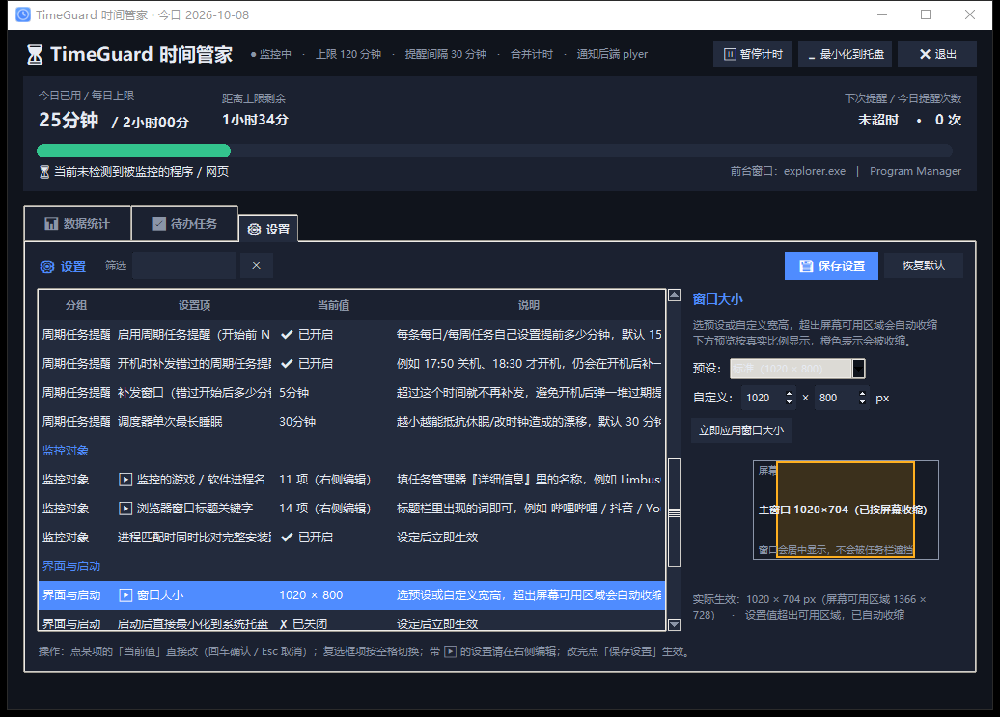 | 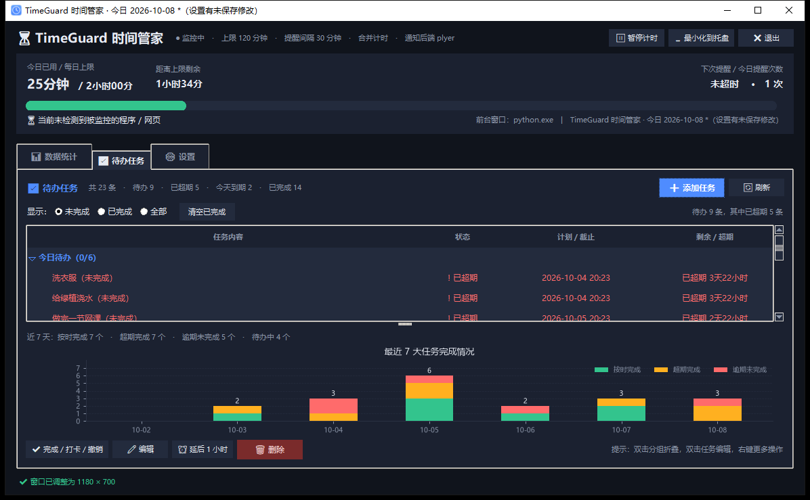 |

| **累计打卡任务（v1.5）**：进度条 + 打卡热力图 | 攒够次数后自动变「提前完成」并停止提醒 |
| --- | --- |
| 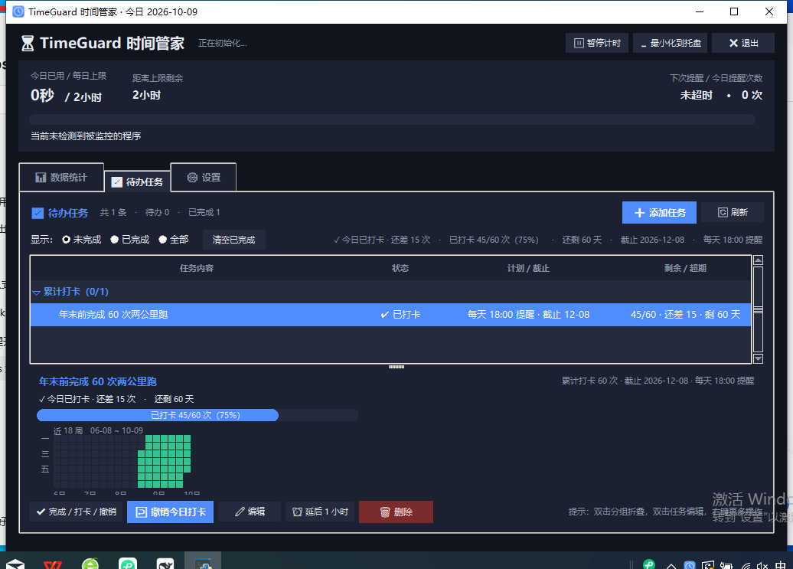 | 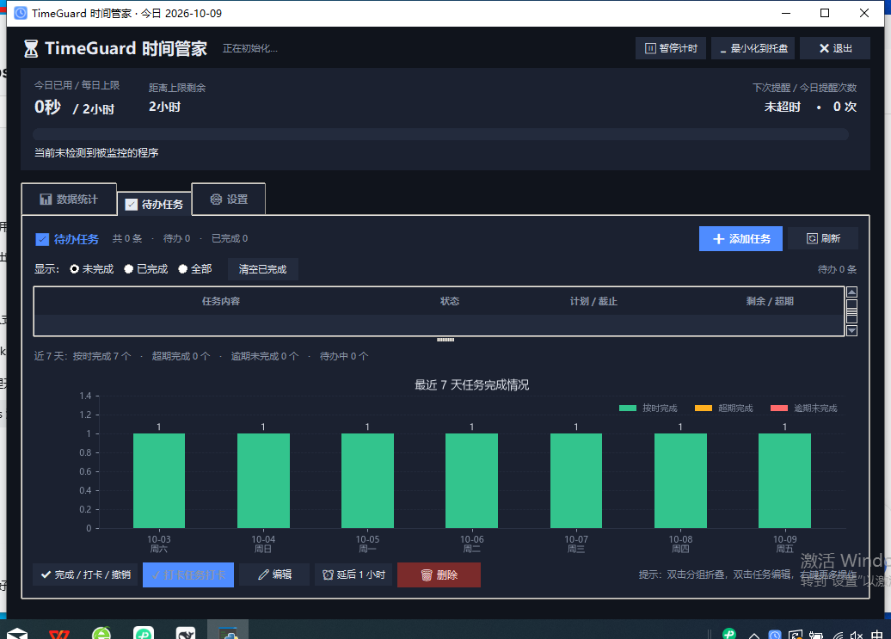 |

| 逾期未达标（**只有过了截止日才会出现这个状态**） |
| --- |
| 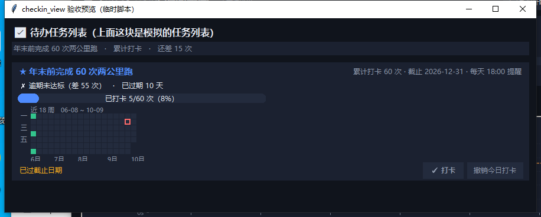 |

---

## 一、功能一览

### 使用时长监控（原有）

| 模块 | 能力 |
| --- | --- |
| 监控对象 | ① 游戏/软件**进程名**（如 `game.exe`、`League of Legends.exe`）；② 浏览器**窗口标题关键字**（如 `哔哩哔哩`、`抖音`、`YouTube`） |
| 计时逻辑 | 仅当被监控窗口处于**前台且未最小化**时累计；锁屏、休眠、切到别的软件自动暂停；跨天自动归零 |
| 目标与提醒 | 默认每日 **2 小时**上限（可改）；超限后右下角系统通知 + 置顶强制弹窗；之后每 **30 分钟**（可改）再提醒一次 |
| 提醒文案 | “注意！你已累计使用【哔哩哔哩】2小时00分，已达到今日上限（2小时00分），建议立即休息。” |
| 数据可视化 | matplotlib 柱状图嵌入界面，自动标记超限日与每日上限参考线；数据存本地 SQLite，可导出 CSV |
| 贴心设计 | 全屏游戏时暂缓弹窗（退出全屏补发）；弹窗冷却防轰炸；无第三方库时自动降级（通知退回 PowerShell、图表退回文字提示、pywin32 退回 ctypes） |

### 待办任务管理（新增）

| 模块 | 能力 |
| --- | --- |
| 任务添加 | “✅ 待办任务”标签页 → ➕ 添加任务；选**重复周期**：`单次` 填截止时间（**日历式选择 + 时/分下拉，精确到分钟**），`每天` / `每周` 填**时间段**（如 06:00~08:00）并可设**提前 N 分钟提醒**（默认 15 分钟）；每周任务可多选星期几（含「工作日 / 周末 / 全选 / 清空」快捷键）；**`累计打卡`（v1.5）** 填**总目标次数**（如 60 次）+ **最终截止日期**（只选日期，含「本月底 / 3 个月后 / 半年后 / 今年底」快捷键）+ **每日提醒时间**（如 18:00）；可标“重要”，单次任务也可设为“无期限” |
| 快捷时间 | 1 小时后 / 3 小时后 / 今晚 20:00 / 明天此时 / 明早 09:00，一键设定 |
| 状态展示 | 列表**按「今日待办 / 本周待办 / 累计打卡 / 其他」分组**（分组标题显示「已完成/总数」，可折叠，双击分组也能折叠展开）；每行显示 `○ 待办 / ! 已超期 / ✔ 已完成` 与倒计时；**周期任务**显示 `○ 待完成 / 进行中，还剩 X / 已超期 X / ✔ 已完成（迟到 X）`，并写明计划（如 `每天 17:45~18:45`、`周四、周六 18:00~20:00`）；**累计打卡任务**显示 `○ 未打卡 / ✔ 已打卡 / ★ 提前完成 / ★ 压哨完成 / ! 逾期未达标` + `45/60 · 还差 15 · 剩 60 天` |
| 状态管理 | 单次任务：勾选完成 / 取消完成、编辑、删除、**延后 1 小时**、延后到明天、清空已完成；**周期任务**：「完成」= 给**今天**打卡（再点一次撤销），删除会连同打卡历史一起删，**不能延后**（时间由时间段决定，会给出说明）；**累计打卡任务**：「✓ 今日打卡 / ↩ 撤销今日打卡」（双击该行、右键菜单、下方按钮三种入口都可以），删除会连同打卡历史一起删，**不能延后**（截止日期是整体目标的一部分）；双击编辑、右键更多操作 |
| 累计打卡任务（v1.5） | "年末前完成 60 次两公里跑"这种**攒次数**的任务：每天到点提醒一次「该打卡了」，点一下就 +1；**选中它时下半屏换成「进度条 + 打卡热力图」**（近 18 周绿色格子，一眼看出坚持了多久）；**截止日之前绝不显示"逾期"**（只有"未打卡 / 还差 X 次 / 进行中"），攒够就变「提前完成 / 压哨完成」并**自动停止提醒** |
| 周期任务 | 每天 / 每周两种周期，每天固定时间段；**完成状态记在 `task_logs`**（一天一条），所以"今天完成"不会变成"永久完成"；到点前的提醒由调度器算准时刻触发，同一刻的多个任务**合并成一个窗**；**新建时如果今天的时间已经过了，就从明天开始**（不会一建出来就显示"今天已超期"） |
| 开机提醒 | **每天首次启动**软件时自动检查未完成任务 → **软件弹窗**列出全部任务的名称 + 截止时间 + 随机鼓励语（弹出 5 秒后自动关闭，带倒计时；右上角有大号 ✕）；系统通知另按“临近截止”规则发送（见下），两者分工**不会同时打扰**；可点“查看待办列表”直接跳转 |
| 提醒分工 | **软件弹窗**＝每次启动列全部未完成（看得见的清单）；**系统通知**＝只在截止不足 **24 小时**（可调）时发，同一任务 **6 小时**内不重复（可调）；超期任务标注“已超期 X” |
| 鼓励语 | 内置 **18 句**离线鼓励语库，`random.choice` 抽取，可点“换一句鼓励”，完全不需要联网 |
| 开机自启 | 设置页一个勾选框即可写入注册表 `Run` 键（`winreg`，当前用户、免管理员）；更换安装位置后会自动修正路径 |
| 任务图表 | 最近 7 天**堆叠柱状图**：绿色=按时完成，橙色=超期完成，红色=逾期未完成，并给出“按时完成 X 个 / 超期完成 Y 个 / 逾期未完成 Z 个”的文字摘要 |
| 托盘集成 | 托盘菜单新增“查看待办任务”“待办提醒”；悬浮提示显示今日时长 + 待办数量（含超期数） |
| 系统托盘 | 最小化到托盘静默运行，不占任务栏；托盘菜单可显示窗口 / 暂停计时 / 立刻提醒 / 查看待办 / 退出 |
| 窗口与布局 | **窗口大小可在设置页自由选择**（4 个预设 + 自定义宽高 + 占满屏幕），带**实时预览图**；超出屏幕可用区域自动收缩；统计页与待办页的上下比例都能**拖拽分隔条**自行调整 |

---

## 二、项目文件结构

```
timeguard/
├── timeguard/                  # 主程序包
│   ├── __init__.py             # 版本信息
│   ├── __main__.py             # 支持 python -m timeguard 启动
│   ├── paths.py                # 统一路径（%APPDATA%\TimeGuard、resources）
│   ├── utils.py                # 时长格式化、原子 JSON 读写、限流器
│   ├── config.py               # 设置数据模型 + JSON 持久化（原子写入）
│   ├── database.py             # SQLite 存储层（时长记录 + 待办任务 / 聚合 / CSV 导出）
│   ├── winapi.py               # Windows API：前台窗口、标题、进程、全屏、锁屏、DPI
│   ├── engine.py               # 使用时长监控与计时引擎（后台线程，核心逻辑）
│   ├── notifier.py             # 系统通知 + 使用时长强制弹窗 + 提示音
│   ├── chart.py                # matplotlib 7 天使用时长柱状图（嵌入 tkinter）
│   ├── autostart.py            # 【新增】开机自启（winreg 写注册表 Run 键）
│   ├── phrases.py              # 【新增】内置 18 句离线鼓励语库
│   ├── datepicker.py           # 【新增】日期时间选择控件（tkcalendar + 降级实现）
│   ├── recurrence.py           # 【新增】周期 / 累计打卡规则纯函数（时间段、下次触发、状态机）
│   ├── scheduler.py            # 【新增】任务调度器（算准时刻不轮询 + 合并派发 + 达标即停）
│   ├── tasks.py                # 【新增】待办面板（分组列表 / 打卡）/ 任务对话框（单次·每天·每周·累计打卡）/ 任务图表 / 提醒弹窗
│   ├── checkin_view.py         # 【v1.5 新增】累计打卡的进度条 + 打卡热力图 + 详情面板（全部自绘）
│   ├── settings_preview.py     # 【新增】窗口尺寸预设 + 「实时预览」画布控件
│   ├── settings_page.py        # 【新增】数据驱动设置页（左列表 + 右编辑器，见下文性能章节）
│   ├── ui.py                   # 主界面 + 系统托盘（含待办/设置标签页接线）
│   └── main.py                 # 入口（含 --selftest 自检、启动自启校正）
├── tests/
│   ├── test_core.py            # 22 个测试：时长监控核心逻辑
│   ├── test_tasks.py           # 32 个测试：待办任务 / 列表分组 / 鼓励语 / 自启 / 日期选择 / 通知窗口
│   ├── test_recurrence.py      # 48 个测试：周期规则（每天/每周、时间段、跨天、下次触发、生效起始日）
│   ├── test_scheduler.py       # 49 个测试：调度器（合并、去重、迟到补发、异常自愈、累计打卡提醒）
│   └── test_cumulative.py      # 21 个测试：累计打卡（状态机、自然日边界、防重复、统计联动、迁移）
├── tools/
│   ├── make_icon.py            # 生成 resources/icon.ico / icon.png
│   ├── ui_smoke.py             # 开发用 GUI 冒烟测试（截图 + 滚动残影检查，可删）
│   ├── e2e_phase4_ui.py        # 开发用端到端验证：周期任务界面（建任务/分组/打卡/校验）
│   ├── e2e_cumulative.py       # 开发用端到端验证：累计打卡（对话框/打卡/提醒/热力图/逾期边界）
│   ├── e2e_tray_close.py       # 开发用端到端验证：叉号二选一 / 托盘提示语 / 恢复后窗口在屏幕内
│   ├── e2e_settings_inline.py  # 开发用端到端验证：设置页就地编辑（数字+单位 / 开启·关闭）
│   ├── e2e_startup_dialog.py   # 开发用端到端验证：开机提醒弹窗（每天一次 / 倒计时 / 大号 ✕）
│   ├── e2e_start_date.py       # 开发用端到端验证：周期任务"时间已过就从明天开始"
│   ├── clear_toasts.ps1       # 清掉测试留在 Windows 通知中心里的气泡
│   ├── e2e_reminder.py         # 开发用端到端验证：真实触发超限提醒
│   ├── e2e_task_reminder.py    # 开发用端到端验证：开机待办提醒弹窗
│   ├── e2e_task_notify_split.py # 开发用端到端验证：两种提醒分工不重复
│   ├── e2e_recurring_reminder.py # 开发用端到端验证：周期提醒合并/去重/迟到补发
│   └── e2e_startup_check.py    # 开发用端到端验证：开机错过与补发闭环
├── packaging/                  # 安装包制作（已实机验证）
│   ├── build_installer.ps1     # 一键生成安装包 + 桌面快捷方式 + 绿色版
│   ├── installer.bat           # 自解压后自动运行的安装脚本（纯 ASCII/CRLF）
│   ├── create_shortcuts.ps1    # 负责中文目录名与快捷键（Unicode 安全）
│   └── readme-chs.txt          # 随安装包分发的中文使用说明
├── resources/                  # 图标（由 tools/make_icon.py 生成）
├── requirements.txt            # 运行依赖
├── requirements-dev.txt        # 打包 / 检查依赖
├── TimeGuard.spec              # PyInstaller 打包配置
├── build.bat                   # 一键打包脚本
├── dev_setup.bat               # 一键装依赖 + 自检 + 测试
├── run.pyw                     # 无控制台窗口启动（双击可用）
└── 启动TimeGuard.bat           # 双击启动（调用 pythonw）
```

运行期数据（不会污染源码目录）：

```
%APPDATA%\TimeGuard\
├── config.json     # 你的设置（可直接编辑，保存后立即生效）
├── usage.db        # SQLite：时长记录 + 待办任务
│                     daily_target / tick_log / hourly / meta / tasks / task_logs
└── timeguard.log   # 滚动日志（排查问题用）
```

---

## 二·五、数据库表设计（含新增的 tasks 表）

升级是**自动且安全**的：所有建表语句都是 `CREATE TABLE IF NOT EXISTS`，
老版本数据库第一次被新版打开时会自动补建 `tasks` 表，**不会动任何已有的时长数据**
（见 `timeguard/database.py` 里的 `_SCHEMA`）。

### 时长监控（原有，未改动）

```sql
-- 每个监控对象 × 每一天的累计秒数（时长图表直接取这张表）
CREATE TABLE IF NOT EXISTS daily_target (
    day         TEXT NOT NULL,                    -- 'YYYY-MM-DD'
    target_name TEXT NOT NULL,                    -- 对象名（进程名或网页关键字）
    target_kind TEXT NOT NULL DEFAULT 'process',  -- process / web / game
    seconds     REAL NOT NULL DEFAULT 0,
    updated_at  TEXT NOT NULL,
    PRIMARY KEY (day, target_name)
);

-- 明细流水（默认保留 30 天，便于日后扩展分析）
CREATE TABLE IF NOT EXISTS tick_log (
    id INTEGER PRIMARY KEY AUTOINCREMENT,
    day TEXT NOT NULL, ts TEXT NOT NULL,
    target_name TEXT NOT NULL, target_kind TEXT NOT NULL, seconds REAL NOT NULL
);
CREATE INDEX IF NOT EXISTS idx_tick_day ON tick_log(day);

-- 小时级分布
CREATE TABLE IF NOT EXISTS hourly (
    day TEXT NOT NULL, hour INTEGER NOT NULL,
    seconds REAL NOT NULL DEFAULT 0, PRIMARY KEY (day, hour)
);

-- 键值杂项
CREATE TABLE IF NOT EXISTS meta (key TEXT PRIMARY KEY, value TEXT);
```

### 待办任务（含 v1.3 周期性任务）

**核心设计：规则与发生记录分离**

| 表 | 存什么 | 一句话 |
| --- | --- | --- |
| `tasks` | **规则** | 这个任务是什么、什么时候该做 |
| `task_logs` | **发生记录** | 这个任务哪一天做了没有、提醒过没有 |

周期任务**永远不写 `tasks.completed`** —— 否则"今天完成"会变成"永久完成"（明天不会自动变回未完成）。
所以 `completed` / `completed_at` 从此只服务于**单次任务**。

```sql
CREATE TABLE IF NOT EXISTS tasks (
    id             INTEGER PRIMARY KEY AUTOINCREMENT,  -- 任务 ID
    title          TEXT    NOT NULL,                   -- 任务内容
    due_at         TEXT,                               -- 截止时间（只有单次任务用）
    created_at     TEXT    NOT NULL,                   -- 创建时间
    completed      INTEGER NOT NULL DEFAULT 0,         -- 是否完成（只有单次任务用）
    completed_at   TEXT,                               -- 完成时间
    priority       INTEGER NOT NULL DEFAULT 1,         -- 1 普通 / 2 重要
    remind_count   INTEGER NOT NULL DEFAULT 0,         -- 被开机提醒过几次
    last_remind_at TEXT,                               -- 最近一次提醒时间
    notified_at    TEXT,                               -- 最近一次发系统通知的时间（间隔控制）
    notified_within_hours REAL,                        -- 发通知时用的“临近截止”阈值
    note           TEXT,                               -- 备注（预留）
    -- ↓ v1.3 周期性任务的规则字段
    task_type              TEXT    NOT NULL DEFAULT 'once', -- once 单次 / daily 每天 / weekly 每周
    time_start             TEXT,                            -- 时间窗开始 'HH:MM'
    time_end               TEXT,                            -- 时间窗结束 'HH:MM'
    days_of_week           TEXT,                            -- 每周任务：ISO 星期 '1,3,5'（1=周一）
    remind_before_minutes  INTEGER NOT NULL DEFAULT 15,     -- 提前多少分钟提醒
    start_date             TEXT                             -- v1.4 生效起始日 'YYYY-MM-DD'（空=一直有效）
);
CREATE INDEX IF NOT EXISTS idx_tasks_completed ON tasks(completed);
CREATE INDEX IF NOT EXISTS idx_tasks_due       ON tasks(due_at);
CREATE INDEX IF NOT EXISTS idx_tasks_created   ON tasks(created_at);
CREATE INDEX IF NOT EXISTS idx_tasks_notify    ON tasks(notified_at);
CREATE INDEX IF NOT EXISTS idx_tasks_type      ON tasks(task_type);

-- 周期任务的发生记录（"每日跑步的打卡记录"就在这里）
CREATE TABLE IF NOT EXISTS task_logs (
    id           INTEGER PRIMARY KEY AUTOINCREMENT,
    task_id      INTEGER NOT NULL,                    -- 对应 tasks.id
    occur_date   TEXT    NOT NULL,                    -- 这一次发生在哪一天 'YYYY-MM-DD'
    completed    INTEGER NOT NULL DEFAULT 0,          -- 该次是否已打卡
    completed_at TEXT,                                -- 打卡时间
    was_late     INTEGER NOT NULL DEFAULT 0,          -- 是否迟到完成（超过 time_end）
    remind_at    TEXT,                                -- 本次提前提醒实际发出时间
    remind_kind  TEXT,                                -- advance 正常提前 / late 开机补发
    note         TEXT,
    FOREIGN KEY (task_id) REFERENCES tasks(id) ON DELETE CASCADE,
    UNIQUE (task_id, occur_date)                      -- 数据库级防重复打卡 / 重复提醒
);
CREATE INDEX IF NOT EXISTS idx_task_logs_date ON task_logs(occur_date);
CREATE INDEX IF NOT EXISTS idx_task_logs_task ON task_logs(task_id, occur_date);

-- ============ v1.5 累计打卡任务的打卡历史（新增）============
-- 一条记录 = 某一天打的一次卡。**进度条与热力图唯一的数据来源**
-- （只存一个 current_count 字段是不够的：图表需要知道你是哪一天打的卡）。
CREATE TABLE IF NOT EXISTS check_in_logs (
    id           INTEGER PRIMARY KEY AUTOINCREMENT,
    task_id      INTEGER NOT NULL,                     -- 对应 tasks.id
    checkin_date TEXT    NOT NULL,                     -- 打卡归属的自然日 'YYYY-MM-DD'（本地时区）
    checkin_at   TEXT    NOT NULL,                     -- 实际打卡时刻（精确到秒）
    note         TEXT,                                 -- 备注
    source       TEXT    NOT NULL DEFAULT 'manual',    -- manual 手动 / backfill 补签（预留）
    FOREIGN KEY (task_id) REFERENCES tasks(id) ON DELETE CASCADE,
    UNIQUE (task_id, checkin_date)                     -- **同一天只能打一次卡**（数据库级保证）
);
CREATE INDEX IF NOT EXISTS idx_checkin_task_date ON check_in_logs(task_id, checkin_date);
CREATE INDEX IF NOT EXISTS idx_checkin_date ON check_in_logs(checkin_date);
```

`tasks` 表在 v1.5 又加了 3 列（同样走 `_TASK_COLUMN_MIGRATIONS` 自动补列）：

```sql
ALTER TABLE tasks ADD COLUMN target_count INTEGER;   -- 总目标次数（如 60）
ALTER TABLE tasks ADD COLUMN deadline     TEXT;      -- 最终截止日期 'YYYY-MM-DD'（**含当天**）
ALTER TABLE tasks ADD COLUMN remind_time  TEXT;      -- 每日提醒时间 'HH:MM'
```

> 为什么不复用 `time_start/time_end/days_of_week`：累计打卡任务**没有"今天几点到几点做"**这个概念，
> 复用会让窗口判定、列表文案、统计口径通通多出一份"假计划"。新建时这 4 个字段一律写 NULL
> （连 `due_at` 也是），e2e 有断言逐列核对。

> **老库自动升级**：v1.2 的 `notified_at` 等列与 v1.3 的 5 个周期字段都是后加的。
> `CREATE TABLE IF NOT EXISTS` 不会给已存在的表补列，所以 `UsageStore._migrate_columns()`
> 会用 `PRAGMA table_info` 检查后逐列 `ALTER TABLE ADD COLUMN`，**只加列、不动任何既有数据**；
> 依赖新列的索引也会在补列之后再建（否则老库打开时会报 `no such column`）。
> 覆盖测试：`test_legacy_database_migration_adds_notify_columns`、
> `test_legacy_database_migration_adds_recurrence_columns`。

**累计打卡任务的时序逻辑（v1.5 核心，也是用户最在意的部分）**

```
每天 18:00（用户设的提醒时间）
   │
   ├─ 已攒够目标次数？ ──── 是 ──► 不再提醒（连定时器都不排）
   ├─ 今天 > 截止日？  ──── 是 ──► 不再提醒（任务已结束）
   ├─ 今天已打过卡？   ──── 是 ──► 今天不再提醒，顺延到明天 18:00
   ├─ 今天提醒过一次？ ──── 是 ──► 今天不再提醒（task_logs.remind_at 去重）
   └─ 到点了 ────────────────► 弹「该打卡了」（同一刻的多个任务合并成一个窗）
                                 │
                                 └─ 用户点「✓ 打卡」→ check_in_logs 插入一行
                                                       （UNIQUE 保证同一天只成功一次）
```

| 状态 | 触发条件 | 界面文案 | 还提醒吗 |
| --- | --- | --- | --- |
| 进行中 | 今天 ≤ 截止日 且 次数 < 目标 | `○ 今日未打卡 · 还差 15 次` / `✓ 今日已打卡 · 还差 15 次` | ✅ 每天提醒一次 |
| 提前完成 | 第 N 次打卡（N=目标）发生在**截止日之前** | `★ 提前完成（11-20 达标）` | ❌ 立即停止 |
| 压哨完成 | 第 N 次打卡正好在**截止日当天**（23:59 也算） | `★ 压哨完成（截止日当天达标）` | ❌ 立即停止 |
| 逾期未达标 | **今天 > 截止日** 且 次数 < 目标 | `✗ 逾期未达标（差 15 次）` | ❌ 停止 |

**这四条规则对应的 5 个坑（用户逐条点名的）**

| # | 坑 | 这里的做法 | 测试 |
| --- | --- | --- | --- |
| 1 | 提前完成后每天还在弹窗骚扰 | `compute_schedule` 里"次数够了"直接 `continue`，`next_checkin_reminder(finished=True)` 返回 `None` | `test_cumulative_reminder_stops_once_target_reached`、`test_reminder_stops_after_target_reached` |
| 2 | 凌晨打卡算哪天 / 同一天重复打卡 | 一律用**本地** `date`（自然日 00:00~23:59:59，不用 UTC）；`UNIQUE(task_id, checkin_date)` 数据库级防重 | `test_natural_day_boundary_uses_local_date`、`test_same_day_can_only_check_in_once` |
| 3 | 打卡是否真实（与监控联动） | v1.5 明确做**手动一键打卡**（诚信机制），不做"监控时长够了自动打卡" | —（有意不做） |
| 4 | 只有计数字段画不出热力图 | 独立 `check_in_logs` 表；进度条与热力图都从它来 | `test_checkin_history_supports_heatmap` |
| 5 | 逾期定义不严谨（截止日当天算不算） | **只有** `今天 > 截止日` 且次数不够才判逾期；截止日当天 23:59 打卡仍算完成 → 「压哨完成」 | `test_only_the_day_after_deadline_becomes_missed`、`test_checkin_on_deadline_day_is_allowed_and_finishes_on_time` |

> **"截止日之前绝不出现逾期字样"是怎么保证的**：状态只有一个来源 ——
> `recurrence.cumulative_status()`。列表分组、今日统计 `task_counts()`、7 天图表
> `task_stats_by_day()`、CSV 导出、提醒文案全都调用它，谁都不许自己写一套判断。
> `status_text()` 在 `STATE_RUNNING` 分支里根本没有"逾期/失败"这两个词。

**周期任务的判定规则**
| 概念 | 判定 |
| --- | --- |
| 今天该做 | **今天在生效期内**（`start_date` 空或 ≤ 今天）**且**今天在计划内（每天=总是；每周=今天在 `days_of_week` 里）**且**今天还没打卡 |
| 本次已超期 | 今天该做 **且** `now > time_end` **且** 今天没有完成记录 |
| 迟到完成 | 打卡时刻 `> time_end` → `was_late=1`（图表里与"按时完成"分开计数） |
| 单次任务 | 沿用原有 `due_at / completed / is_overdue` 逻辑，口径不变 |

**生效起始日 `start_date`（v1.4，用户反馈驱动）**

用户反馈的原话是："设置每日任务时，如果设置的提醒时间是在目前时间之前，软件会默认逾期，
但站在用户的角度上来说，用户是希望任务从明天开始的。"

所以新建 / 改时间段时会按"**今天这个时间窗是不是已经过去了**"决定生效日：

| 场景 | 生效日 | 今天的样子 |
| --- | --- | --- |
| 晚上 21 点建「每天 06:00~08:00」 | **明天** | 不排班、不算逾期；列表里在「本周待办」，文案写「每天 06:00~08:00（10-09 开始）」 |
| 晚上 21 点建「每天 22:00~23:00」 | 今天 | 正常进「今日待办」，`○ 待完成` |
| 老数据（没有 `start_date` 这一列的值） | 不限制 | 行为完全不变：错过了就照旧显示"已超期" |

这条规则同时管住了四个地方，不会出现"列表说逾期、图表不认"的自相矛盾：
列表分组（`build_task_rows`）、今日统计（`task_counts`）、7 天图表（`task_stats_by_day`）、
调度器下一次唤醒（`compute_schedule`）——因为它们都走同一个 `rule.occurs_on(day)`。

> 编辑已有任务时也适用（把时间段改成"今天已经过去"的，同样从明天开始），
> **但今天已经提醒过或已经打过卡的不动** —— 否则那条打卡记录会变成"计划外的幽灵数据"。
> 对话框底部预览会直接写明"（今天的时间已过，从 10-09 开始）"，不用用户去猜。

**字段与需求对应关系**

| 需求字段 | 表字段 | 说明 |
| --- | --- | --- |
| ID | `id` | 自增主键 |
| 任务内容 | `title` | 最长 200 字 |
| 截止时间 | `due_at` | 精确到秒存储，界面精确到分钟；可为空表示“无期限”（单次任务） |
| 创建时间 | `created_at` | 写入时自动填当前时间 |
| 是否完成 | `completed` + `completed_at` | 只存布尔不够——记录完成时刻才能判断“按时完成 / 超期完成”（单次任务） |
| 任务类型 | `task_type` | once / daily / weekly |
| 开始·结束时间 | `time_start` / `time_end` | 周期任务的时间窗，`'HH:MM'` |
| 星期几 | `days_of_week` | 每周任务多选，ISO 编码 `'1,3,5'` |
| 提前提醒 | `remind_before_minutes` | 默认 15 分钟 |
| 生效起始日 | `start_date` | 空 = 一直有效（老数据）；新建时若"今天的时间窗已过"自动填明天 |
| 某天是否完成 | `task_logs.completed` | 周期任务的状态只认这张表 |

**统计口径（任务图表）**

| 分类 | 判定条件 |
| --- | --- |
| 按时完成 | 单次：`completed=1` 且（无截止时间 或 `completed_at <= due_at`）；周期：`task_logs.was_late=0` |
| 超期完成 | 单次：`completed=1` 且 `completed_at > due_at`；周期：`task_logs.was_late=1` |
| 逾期未完成 | 单次：`completed=0` 且 `due_at < 现在`；周期：计划内、没打卡、且当天已过 `time_end` |
| 待办中 | 还没到期（不计入失败，避免“冤枉”未来任务） |

按日期归集到最近 7 天：单次任务按 `created_at`，周期任务按 `task_logs.occur_date`。

---

## 三、安装与运行

### 1. 环境要求

- Windows 10 / 11
- Python 3.10+（开发验证环境为 3.14）

### 2. 安装依赖

```bat
cd timeguard
python -m pip install -r requirements.txt
```

也可以直接双击 `dev_setup.bat`：自动装依赖 → 环境自检 → 跑单元测试。

### 3. 启动

| 方式 | 命令 | 说明 |
| --- | --- | --- |
| 推荐 | `python -m timeguard` | 带日志的控制台启动，便于排查 |
| 双击 | `run.pyw` | 无控制台窗口（最接近最终体验） |
| 双击 | `启动TimeGuard.bat` | 同上，用 `pythonw` 启动 |
| 自检 | `python -m timeguard --selftest` | 检查依赖、数据库、前台窗口识别 |
| 静默 | `python -m timeguard --minimized` | 启动即进托盘 |

### 4. 首次使用建议

1. 打开「设置」页，把**每日时长上限**改成你真实的目标（如 1 小时 30 分）。
2. 在「监控的游戏 / 软件进程名」里加入你的游戏进程名：
   任务管理器 → 详细信息 → 找到游戏进程 → 右键“打开文件位置”确认名称，例如
   `League of Legends.exe`、`GenshinImpact.exe`、`cs2.exe`。
3. 在「浏览器窗口标题关键字」里加入你容易沉迷的站点名（标题栏里出现的词即可）。
4. 点 **💾 保存设置**（立即生效，无需重启），再点 **🔔 测试提醒** 确认通知效果。
5. 点 **🗕 最小化到托盘**，让它安静地在后台工作。

> **关闭行为说明（v1.4 起）**：点标题栏的 **叉号**会弹一个小窗让你选——
> 「🛑 退出程序」或「🗕 后台继续运行」；选哪个都会发一条系统通知明确告诉你结果
> （"软件已退出运行" / "已在后台运行"，后者只发一次）。这样做是因为以前叉号
> **其实是收进托盘**，用户以为关掉了、监控却还在跑 —— 界面等于在说谎。
> 选「后台继续运行」也可以随时点托盘图标把窗口叫回来；程序启动时若设了
> "启动即最小化"则**不会**弹任何提示（用户没做操作就不该被打扰）。

> **开机提醒弹窗的规矩（v1.4 起）**：
> * **每天只在首次启动软件时弹一次**（`config.json` 的 `startup_dialog_date` 记着日期）；
>   同一天再启动就不弹了 —— 但错过的周期提醒**照旧派发**，只是不再重复弹窗打扰；
> * 弹出后 **5 秒**内没被关闭就**自动关闭**，窗口里有一行明显的倒计时
>   （"⏳ 5 秒后自动关闭　（点「✕」或下面按钮可立即关闭）"）；
> * 窗口右上角有**一个大号 ✕ 按钮**（52×44px）。系统的标题栏叉号又小又紧贴屏幕
>   边缘（弹窗是贴右下角放的），实测"点了像没反应"，所以自己放了一个大的；
>   按 Esc 也能关。

---

## 四、打包与分发（安装包 + 桌面快捷方式）

### 1. 安装打包依赖

```bat
python -m pip install -r requirements-dev.txt
```

### 2. 一键打包成 exe

```bat
build.bat
```

脚本会依次：生成图标 → 运行自检 → 清理旧产物 → 调用 PyInstaller。
产物：`dist\TimeGuard\TimeGuard.exe`（目录模式，启动最快）。

等价的手动命令：

```bat
python tools\make_icon.py
pyinstaller TimeGuard.spec --noconfirm
```

### 3. 制作安装包 + 桌面快捷方式

```powershell
powershell -NoProfile -ExecutionPolicy Bypass -File packaging\build_installer.ps1
```

该脚本会产出：

| 产物 | 说明 |
| --- | --- |
| `dist\TimeGuard-Setup.exe` | **单文件自解压安装程序**（7-Zip SFX 方案，约 29 MB）。双击 → 确认 → 自动解压到 `%TEMP%` → 自动运行安装脚本 → 安装到桌面并建快捷方式 |
| `dist\TimeGuard_portable.zip` | 便携版（约 41 MB），解压即用，适合拷到别的电脑 |
| `桌面\TimeGuard 时间管家\` | 已安装好的程序目录（绿色版，直接可运行） |
| `桌面\TimeGuard 时间管家.lnk` | 桌面快捷方式，带图标 |
| `桌面\TimeGuard-Setup.exe` | 安装程序副本（可发给别人安装） |
| `桌面\TimeGuard_portable.zip` | 便携版副本 |

安装程序运行时还会自动创建：开始菜单快捷方式、开机自启快捷方式（在「启动」文件夹里），
并把中文版 `使用说明.txt` 放进安装目录。

只重建桌面快捷方式和绿色版目录（不重新打包）：

```powershell
powershell -NoProfile -ExecutionPolicy Bypass -File packaging\build_installer.ps1 -DesktopOnly
```

### 4. 安装包的两条硬性约束（踩过的坑）

打包脚本会自动校验，改脚本时请保持：

1. **`installer.bat` 必须是纯 ASCII + CRLF。** cmd.exe 按控制台代码页解析批处理，
   带中文的 UTF-8 批处理会被读成乱码命令（实测会报 `'xx' 不是内部或外部命令`）。
   所有中文目录名 / 中文快捷方式名一律交给 `create_shortcuts.ps1` 处理。
2. **批处理不能删除自己所在的目录。** cmd 会持续从磁盘读取当前批处理文件，
   `rd /s /q "%~dp0"` 会让脚本执行到一半就中断（报「系统找不到指定的路径」并返回 1）。
   解压出的 `%TEMP%` 目录交给系统清理。

### 5. 打包成单文件 exe（另一种选择，无安装流程）

```bat
pyinstaller --noconfirm --onefile --windowed ^
  --name TimeGuard ^
  --icon resources\icon.ico ^
  --add-data "resources;resources" ^
  --hidden-import plyer.platforms.win.notification ^
  --hidden-import pystray._win32 ^
  --hidden-import matplotlib.backends.backend_tkagg ^
  run.pyw
```

产物：`dist\TimeGuard.exe`（约 40–60 MB，首次启动需解包 1–3 秒）。

### 5. 打包必须知道的三个坑（都是实际踩过的）

**① `run.pyw` 里 `sys.path.insert` 必须独立成行。**
曾被写成"注释把代码吞进同一行"，结果运行时靠当前目录侥幸能跑、测试全绿，
但 PyInstaller 静态分析找不到 `timeguard` 包，打出一个**空壳 exe**，
双击才弹 `No module named 'timeguard.main'`。现在该文件有独立注释警示。

**② 本程序包用「数据文件」方式打包，必须显式声明它的全部导入。**
本机 PyInstaller 的模块图解析不到 `timeguard` 包（同环境下换个包名就正常，
原因未明），所以 `TimeGuard.spec` 不依赖分析器，改为：

- 把 `timeguard\*.py` 作为 `datas` 复制到 `_internal/timeguard/`
  （运行时 `_internal` 已在 `sys.path` 上，实测确认）；
- 但这意味着 PyInstaller **没有分析这些源码**，于是连 `sqlite3`、
  `logging.handlers` 都不会被收集 —— 所以 spec 用 **AST 静态扫描本包的
  import 语句**，把结果全部加进 `hiddenimports`，
  并跳过当前环境未安装的可选依赖（如 `win10toast`），避免打包硬失败。

**③ 部署前必须验证 exe 真的能跑。**
`packaging\build_installer.ps1` 的第 0 步会先运行 `TimeGuard.exe --selftest`，
超时或退出码非 0 就**中止部署并打印日志尾部** —— 就是这道门槛防止了
"构建成功但启动即崩"的坏包被装到桌面。

### 6. 开机自启

打包后把 `TimeGuard.exe` 的快捷方式放进启动目录：

```
Win + R → shell:startup → 把快捷方式粘贴进去
```

或在「任务计划程序」中创建“登录时启动”的任务，并勾选“隐藏”。
（用 `packaging\build_installer.ps1` 生成的安装程序会自动完成这一步。）

### 7. 打包/安装常见问题

| 现象 | 处理 |
| --- | --- |
| 启动即闪退、无界面 | 用 `python -m timeguard` 先跑通源码；exe 的日志在 `%APPDATA%\TimeGuard\timeguard.log` |
| 图表空白/中文方块 | 确保 `resources` 随包一起打包（spec 已配置 `--add-data`）；系统需有微软雅黑字体 |
| 托盘图标不出现 | 检查是否被杀软拦截；`pystray._win32` 必须作为 hidden-import 打包（spec 已含） |
| 体积太大 | 保留 spec 里的 `excludes`（已排除 PyQt、pandas、scipy 等）；或改用目录模式而非单文件 |
| 杀软误报 / 提示"未知发布者" | PyInstaller 产物常被误判，把 exe 加白名单，或对 exe 做代码签名 |
| 安装包双击后一闪而过 | 安装程序解压到 `%TEMP%` 后会自动运行；若被杀软拦截会中断，先加白名单再试 |
| 桌面没有出现快捷方式 | 打开 `桌面\TimeGuard 时间管家\` 手动运行 `TimeGuard.exe`；或右键它 → 发送到 → 桌面快捷方式 |
| 安装脚本报"不是内部或外部命令" | 说明 `installer.bat` 被编辑器存成了 UTF-8 带中文，改回纯 ASCII + CRLF（见第四节约束） |
| 收进托盘后点托盘图标窗口不出现 | v1.3 及更早的版本有此问题（窗口停在 `+10000+10000` 屏幕外），v1.4 已修：隐藏时会先移出屏幕，恢复时会**校验窗口是否真的回到屏幕内**，不在就重新居中 |
| 点叉号后不知道该选哪个 | 两个选项的后果都写在按钮旁边：退出=停止统计；后台继续运行=收进托盘继续统计。选错了也没关系，随时能从托盘图标重新打开或退出 |

---

## 五、参数说明（设置面板 / config.json）

| 字段 | 默认 | 含义 |
| --- | --- | --- |
| `daily_limit_minutes` | 120 | 每日时长上限（分钟），所有监控对象合计 |
| `reminder_interval_minutes` | 30 | 超限后重复提醒间隔（分钟） |
| `remind_immediately_on_exceed` | true | 刚超过上限是否立刻提醒一次 |
| `count_mode` | `total` | `total`=所有对象合并计时；`each`=每个对象单独计时 |
| `monitor_interval_seconds` | 1.0 | 前台窗口采样间隔（秒），越小越精确、CPU 略升 |
| `game_processes` | 见默认 | 游戏/软件进程名白名单（可用 `*` 通配） |
| `browser_processes` | 见默认 | 浏览器进程名白名单 |
| `title_keywords` | 见默认 | 网页标题关键字（命中即计时） |
| `match_path_contains` | true | 是否同时比对完整安装路径 |
| `enable_toast` / `enable_popup` | true | 是否发送系统通知 / 强制弹窗 |
| `enable_sound` | true | 弹窗时播放提示音 |
| `suppress_popup_fullscreen` | true | 全屏游戏时暂缓弹窗，退出全屏后补发 |
| `popup_cooldown_seconds` | 60 | 两次强制弹窗之间最短间隔（防轰炸） |
| `start_minimized` | false | 启动后直接最小化到托盘 |
| `task_check_on_start` | true | 开机 / 首次运行时检查未完成任务并弹窗提醒 |
| `task_reminder_toast` | true | 临近截止时是否另发右下角系统通知（**只对单次任务**） |
| `task_notify_within_hours` | 24.0 | 截止不足这么多小时才发系统通知（0.5–168，只对单次任务） |
| `task_notify_interval_hours` | 6.0 | 同一任务两次系统通知的最小间隔（0.5–72） |
| `recurring_reminder_enabled` | true | 【v1.3】是否启用周期任务的"开始前 N 分钟"提醒 |
| `recurring_late_catchup` | true | 【v1.3】开机时是否补发错过的周期任务提醒 |
| `recurring_catchup_minutes` | 5 | 【v1.3】补发窗口：错过开始后多少分钟内仍补发一次 |
| `scheduler_max_sleep_minutes` | 30 | 【v1.3】调度器单次最长睡眠，越小越能抵抗休眠/改时钟漂移 |
| `autostart_enabled` | false | 是否写入注册表实现开机自启（设置页勾选框控制） |
| `window_width` / `window_height` | 1020 / 800 | 主窗口尺寸；实际会按屏幕可用区域自动收缩 |

### 窗口大小与布局（新增）

设置页底部「🖥 窗口大小」区域：

| 控件 | 说明 |
| --- | --- |
| 预设方案 | 紧凑（1020×700）/ 标准（1020×800）/ 大（1180×900）/ 特大（1320×1000）/ 占满屏幕可用区域 / 自定义 |
| 自定义宽高 | 直接输入像素值，旁边的预览图会立刻跟着变 |
| 预览图 | 按真实比例画出「屏幕可用区域」与「主窗口」；尺寸被屏幕限制时边框变橙色并标注“已按屏幕收缩” |
| 立即应用窗口大小 | 不用保存就能先看效果（只写窗口宽高两个字段） |
| 恢复标准尺寸 | 一键回到 1020 × 800 |

另外两个页面都支持**拖拽分隔条**调整上下比例（中间那条浅色横条）：

- 「📊 数据统计」：上面是 7 天时长柱状图，下面是今日各对象明细表 —— 想看大表格就往下拖；
- 「✅ 待办任务」：上面是任务列表，下面是任务完成情况图表 —— 想看大图表就往上拖。

这样做的好处：以前用固定比例，在 1366×768 这类小屏上（可用高度只有 728）图表会被挤出可视区；
改成可拖拽后任何屏幕高度都能完整看到内容。

### 关闭方式、托盘恢复与 CSV 导出（v1.4）

**点叉号会问你一次**（`CloseChoiceDialog`）：

| 你的选择 | 结果 | 系统通知 |
| --- | --- | --- |
| 🛑 退出程序 | 落库 → 停引擎 → 关调度器 → 移除托盘图标 → 退出 | "TimeGuard 软件已退出运行" |
| 🗕 后台继续运行 | 窗口收进托盘，继续统计；点托盘图标随时打开 | "TimeGuard 已在后台运行"（**一辈子只发一次**） |
| 取消（或按 Esc） | 什么都不做 | 无 |

> **托盘提示只发一次**：虽然"收进托盘"是个明确动作，但每次都弹一条通知仍然很吵。
> 所以只在**第一次**收进托盘时提示，并且文案里直接说明
> "以后最小化到托盘不再自动提示（点托盘图标可随时打开窗口）"；
> 之后无论点按钮、点叉号选后台、还是任务栏最小化，都安静地收进托盘。
> 状态存在 `config.json` 的 `tray_notice_shown` 里（想再看一次提示就把它改回 `false`）。

设计取舍：这两种意图在界面上只差"点了一下叉号"，但后果完全相反 ——
以前"叉号 = 收进托盘"会让用户以为关掉了（界面在说谎），而"叉号 = 一律退出"
又会让习惯用叉号收进托盘的人误关监控。所以把选择权交回用户，
并把两个选项的后果直接写在按钮旁边（而不是让人猜）。

两个已知坑（都已修）：

* **托盘恢复后窗口停在屏幕外**：`hide_to_tray` 会把窗口移到 `+10000+10000`（为了不残留
  任务栏图标），而恢复时紧跟 `deiconify()` 发出的那次 `geometry()` 请求会被 Tk 丢掉，
  窗口就一直停在屏幕外 —— 用户点托盘图标什么都看不到。现在恢复时先
  `update_idletasks()` 再设几何，并且**校验窗口是否真的落在屏幕内**，不在就重新居中。
* **不做统计时不该打扰用户**：只有"用户主动收起窗口"（点按钮 / 任务栏最小化）才发通知；
  启动即最小化、开机自启这类"用户没做任何操作"的情况一律静默。
  另外托盘不可用时**拒绝隐藏窗口**（否则窗口藏起来又没有托盘图标，用户只能去任务管理器）。

**CSV 导出**分三段，周期任务说得清楚：

```
【使用时长】        日期 / 对象 / 类型 / 时长(分钟)
【任务定义】        ID / 任务内容 / 类型 / 计划或截止 / 创建时间 / 是否完成 / 完成时间 / 状态 / 备注
                    · 单次任务：是否完成=是/否，状态=按时完成/超期完成/进行中/已超期
                    · 周期任务：是否完成=「—」，状态写明"周期任务（完成情况见下方打卡记录）"
【周期任务打卡记录】 日期 / 任务 / 类型 / 是否打卡 / 打卡时间 / 是否迟到 / 提醒时间 / 提醒类型 / 备注
```

升级前周期任务会被导出成"无期限 / 未完成"（因为导出只看 `tasks.due_at` 与 `tasks.completed`），
而现在"今天做没做"有专门的打卡记录段 —— 这才是周期任务的真相。
文件用 UTF-8 **带 BOM** 写，Excel 直接双击不会乱码。

### 计时与暂停规则（重要）

- ✅ 计入：被监控进程在前台，且窗口未最小化，且未锁屏。
- ⏸ 暂停：切到其他软件、最小化窗口、锁屏、休眠/待机（单次采样间隔 > 8 秒的时间段直接丢弃）。
- 🌙 跨天：0 点后自动把统计切换到新的一天，并重置提醒计数与弹窗。
- 🖥 全屏：检测到真全屏程序时暂缓弹窗（可在设置里关闭该行为）。

---

## 五·五、开机自启是怎么实现的

用标准库 `winreg` 写当前用户的 Run 键，**不需要管理员权限**：

```
HKEY_CURRENT_USER\Software\Microsoft\Windows\CurrentVersion\Run
    值名：TimeGuard
    值内容（打包成 exe）："C:\...\TimeGuard.exe"
    值内容（源码运行）  ："C:\...\pythonw.exe" "C:\...\run.pyw"
```

- 设置页勾选「开机自动启动 TimeGuard」→ 立即写注册表（失败会提示，可改用 `shell:startup`）；
- 取消勾选 → 立即删除该值；
- 每次启动时 `autostart.reconcile()` 会核对注册表内容与当前程序路径是否一致，
  **换了安装目录会自动修正**，不会留下指向旧路径的死链。
- 手动移除：任务管理器 →「启动」标签页 → 禁用 TimeGuard；或删除上面的注册表值。

---

## 五·六、待办任务模块实现要点

| 关注点 | 实现 |
| --- | --- |
| 日期时间选择 | `datepicker.DateTimePicker`：优先用 **tkcalendar** 的日历下拉 + 时/分下拉框（精确到分钟）；环境里没有 tkcalendar 时自动降级为「年/月/日/时/分」下拉，功能一致 |
| 开机提醒弹窗 | `tasks.StartupReminderDialog`：标题写“今天有 N 条待办任务（M 条已超期）”，逐条列出**任务名称 + 截止时间 + 还剩/已超期**，底部随机抽一句鼓励语，可点「换一句鼓励」；同时发一条系统通知，并把 `remind_count` 记进数据库 |
| 鼓励语 | `phrases.py` 内置 18 句（`random.choice` 抽取，`exclude` 保证连续两次不重复），**完全离线** |
| 列表倒计时 | `TaskPanel.tick()` 每秒只更新「剩余 / 超期」列，不重建整个列表（省 CPU），且只在待办标签页可见时执行 |
| 完成情况图表 | `tasks.TaskStatsChart`：7 天堆叠柱（按时完成/超期完成/逾期未完成）+ 文字摘要，嵌入待办页底部 |
| 系统通知 | `_notify_urgent_tasks()`：**只在临近截止时发**（默认 24 小时内，含已超期），同一任务默认 6 小时不重复。用 `tasks.notified_at` / `notified_within_hours` 两列做间隔与阈值判断：阈值被调大（如 12h→24h）会重新提醒一次。与软件弹窗**分工不重叠** |
| **重复周期对话框** | `tasks.TaskDialog`：`重复周期` 下拉（单次 / 每天 / 每周）切换时用 `grid_remove()` 显示对应字段（控件实例不变，切来切去不会丢值）；每天/每周用 `TimeField`（时:分双下拉，5 分钟粒度）填时间段，每周用 7 个星期复选框 + 「工作日 / 周末 / 全选 / 清空」快捷键；`提前提醒` 默认 15 分钟（0~1440 校验）；底部一行**实时预览**（如「每周任务 · 周一、周三、周五 18:00~20:00 · 开始前 15 分钟提醒 · 下次提醒 10-09 17:45」），预览用的规则与真正入库后读出来的**是同一套代码** |
| **分组列表** | `tasks.build_task_rows()`（纯函数，可单测）把任务分成 `今日待办 / 本周待办 / 其他` 三组：单次任务按截止时间归属；周期任务按"今天排不排班"归属，今天排班的**只进今日组**（不会在两组里重复出现）。Treeview 用 `show="tree headings"`，分组是**真正的父节点**（自带三角箭头，双击也可折叠/展开），标题显示「已完成/总数」 |
| **周期任务的"完成"** | 列表里对周期任务点「完成」是给**今天**打卡（写 `task_logs`），**永远不写** `tasks.completed`；再点一次撤销打卡。单次任务仍是原来的 `tasks.completed` |
| **默认分栏** | 列表与图表之间是可拖拽分隔条：默认取「列表拿一半」与「给图表留 170px」中更保守的一个——平铺 50% 时 728 高的屏幕上 matplotlib 标题会被挤掉一截 |
| 与时长模块解耦 | `tasks.py` 只依赖注入进来的 `store`（数据库）与 ttk 样式名，不 import `engine`，可单独测试 |

---

## 六、开发与测试

```bat
:: 单元测试（134 个用例：22 时长监控 + 31 待办任务与界面分组 + 43 周期性任务 + 38 调度器）
python tests\test_core.py
python tests\test_tasks.py
python tests\test_recurrence.py
python tests\test_scheduler.py
python -m pytest tests -q          :: 有 pytest 时

:: GUI 冒烟测试：自动开窗口、造演示数据、截图到 tools\_shots，并检查滚动合并
python tools\ui_smoke.py

:: 端到端验证：周期任务的界面（建任务 / 分组 / 打卡 / 校验拦截，含截图）
python tools\e2e_phase4_ui.py

:: 端到端验证：叉号二选一 / 托盘提示语 / 恢复后窗口必须在屏幕内
python tools\e2e_tray_close.py

:: 端到端验证：设置页就地编辑（数字带单位、布尔项开启/关闭、单击触发）
python tools\e2e_settings_inline.py

:: 端到端验证：开机提醒弹窗（每天只弹一次 / 5 秒倒计时自动关闭 / 大号 ✕ / 托盘提示只发一次）
python tools\e2e_startup_dialog.py

:: 端到端验证：周期任务的生效起始日（今天时间已过 → 从明天开始，不算逾期）
python tools\e2e_start_date.py

:: 端到端验证：累计打卡任务（对话框 / 打卡 / 每日提醒 / 达标即停 / 热力图 / 逾期边界）
python tools\e2e_cumulative.py

:: 端到端验证：真实跑满每日上限，确认通知 + 强制弹窗被触发
python tools\e2e_reminder.py 15 1 55      :: 运行15秒 / 上限1分钟 / 预置已用55秒

:: 端到端验证：两种提醒分工（非临期只弹窗 / 临期才发系统通知 / 间隔内不重复）
python tools\e2e_task_notify_split.py

:: 端到端验证：开机待办提醒弹窗真的弹出来（含截图）
python tools\e2e_task_reminder.py

:: 端到端验证：周期任务提醒（合并成一个弹窗 / 不重复 / 迟到补发）
python tools\e2e_recurring_reminder.py

:: 端到端验证：开机错过与补发闭环（合并成一个窗 / 重开不重复）
python tools\e2e_startup_check.py

:: 端到端验证：累计打卡任务（对话框 / 打卡 / 每日提醒 / 达标即停 / 热力图 / 逾期边界）
python tools\e2e_cumulative.py

:: 环境自检
python -m timeguard --selftest
```

代码约定：

- 分层清晰：`database`（存储）/ `engine`（计时）/ `notifier`（提醒）/ `ui`（界面）/ `winapi`（系统 API）。
- 线程安全：**只有引擎线程计时**，界面通过 `Snapshot` 快照与队列通信，绝不跨线程操作控件。
- 监控线程永不退出：任何异常都被捕获并退避重试，坏一次不会导致监控停摆。
- 所有可变设置支持热更新：改完保存立即生效。
- 长列表一律走 `VerticalScrolledFrame`，它会把连续滚轮事件**合并为一帧一次重绘**（见下）。

### 提醒调度：算准时刻，不轮询

周期任务的提醒由 `timeguard/scheduler.py` 负责，核心是**算下一次触发的准确时刻**，
而不是"每秒遍历全表"：

```
compute_schedule(任务列表, 发生记录, 现在)          ← 纯函数，可确定性单测
        │
        ├─ 此刻就该响？ ──► ReminderBatch（同一刻的任务**合并成一批**）
        └─ 否则          ──► wakeup_at（下一次唤醒时刻）
                                    │
                    TaskScheduler 只排【一个】 after 定时器
                                    │
                   到点 → 重新 compute_schedule（所以休眠/改时钟都能自愈）
```

| 设计点 | 做法 | 为什么 |
| --- | --- | --- |
| 不轮询 | 纯函数算时刻 + 单个 `after` | 没有 `while True`、没有每秒查表，CPU 与耗电都低 |
| 弹窗不风暴 | 同刻任务合并成一个 `ReminderBatch` | 一次回调、一个弹窗、一条通知（避坑 #5） |
| 休眠健壮 | 单次睡眠上限 `scheduler_max_sleep_minutes`（默认 30） | 醒来重新计算，不依赖"一次排到明天"的长睡眠 |
| 迟到补发 | 开机后若已过开始时间、仍在 `recurring_catchup_minutes`（默认 5）内 → 补发一次并标记 `late` | 关机/休眠错过提醒也能补上；超过窗口就不再打扰（避坑 #1） |
| 不重复打扰 | 去重看 `task_logs(task_id, occur_date).remind_at` | 数据库 `UNIQUE(task_id, occur_date)` 兜底 |
| 通知互斥 | 单次任务走"截止前 24h 通知"；周期任务走"开始前 N 分钟提前提醒" | 同一条任务不会被通知两遍 |

**判定窗口**（S=开始时刻，E=结束时刻，N=`remind_before_minutes`）：

| 现在 | 行为 |
| --- | --- |
| `now < S - N` | 等待，定时器排到 `S - N` |
| `S - N ≤ now < S` | 发**提前提醒**（`remind_kind='advance'`） |
| `S ≤ now ≤ S + 补发窗口` | 发**迟到提醒**（`remind_kind='late'`，标注已过几分钟） |
| `now > S + 补发窗口` | 不补发，直接排到下一次发生 |

端到端验证：`python tools\e2e_recurring_reminder.py`（15 项断言，含合并弹窗、
去重、迟到补发、超窗口不打扰，并截图到 `tools\_shots\14_recurring_reminder.png`）。

### 开机的"错过与补发"闭环（避坑 #1）

关机/休眠错过提醒是**最核心的痛点**。这里的处理是一条完整闭环：

```
开机 → 调度器启动（deferred：只排程、不派发）
        │
        ▼
   startup_check()  ── 只跑一次 ──┐
        │                          │
        ├─ collect_due()   错过的周期任务（含迟到补发）
        ├─ pending_tasks() 未完成的**单次**任务
        │                          │
        ▼                          ▼
   StartupCheckDialog  ← 合并成【一个】窗口，只打扰一次
        │
        ├─ 上半：⏰ 错过的周期任务（迟到提醒，橙色标记）
        └─ 下半：☀ 未完成的待办任务（单次任务，含已超期）
        │
        ▼
   dispatch(batch, silent=True)  ← 只写"已提醒"标记，不再回调
                                    所以关机重开不会重复补发
```

| 设计点 | 说明 |
| --- | --- |
| **一次打扰** | 周期补发与开机待办**合并**成一个 `StartupCheckDialog`，不再各弹一个窗 |
| **不重复补发** | 派发时写 `task_logs.remind_at`，重开程序发现已提醒过就跳过 |
| **超过窗口不打扰** | `recurring_catchup_minutes`（默认 5）之外不再补发，避免开机弹一堆过期提醒 |
| **可关闭** | `recurring_late_catchup=false` 或 `recurring_reminder_enabled=false` 即停用 |
| **口径干净** | `pending_tasks()` **只返回单次任务**，周期任务由 `scheduled_on()` 负责；否则同一件事会在两个区块重复展示 |
| **延后派发** | 调度器 `start(deferred=True)`，把"派发"让给统一检查，否则启动瞬间就会多弹一个窗 |

端到端验证：`python tools\e2e_startup_check.py`（15 项断言，真实开关 4 次主界面，
覆盖：合并成一个窗 / 第二次开机不重复补发 / 补发窗口为 0 不补发 / 关闭开关不补发 /
`pending_tasks()` 口径）。

### 界面性能：设置页为什么改成"数据驱动"

**旧方案的问题**：设置页把上百个 ttk 控件塞进 `Canvas + create_window`，
滚动时要整块重绘。实测**一次滚动重绘 128~155ms（≈8fps）**，
快速上下滑动时事件堆积、画面跟不上 → **文字残影**。

试过的补救都没治本：

| 尝试 | 结果 |
| --- | --- |
| 滚轮事件合并（`after` / `after_idle`） | 重绘次数降下来了，但每帧本身仍然 128ms，残影只是变少 |
| 换成 `place` 平移内容（绕开 Canvas 子窗口） | 0 残影，但每帧仍 123ms —— 说明瓶颈不是滚动机制 |
| 用 `ttk.Treeview` 内部画布承载控件 | Tk 9 的 Treeview 没有内部子窗口，走不通 |

**结论：瓶颈是"每帧重绘上百个子控件"本身**，所以正确做法是**让每帧要重绘的东西变少**。

**现在的方案**（`timeguard/settings_page.py`）——表格自绘 + 就地编辑：

* **表格自绘**：全部设置（分组 / 名称 / 当前值 / 说明）都是 `ttk.Treeview` 的
  **文字行**，由原生控件渲染。滚动 = 画文字，滚动区里**没有任何子控件**。
* **就地编辑**：点某项的「当前值」单元格（第一次点选中、再点一次进入编辑，
  双击同样可以），就在该单元格上浮出一个**浮层容器**：里面是编辑控件 **+ 单位后缀**。
  回车提交、Esc 取消、失焦提交。**同一时刻最多一个编辑控件**。

  为什么是"容器"而不是孤零零一个输入框：表格里显示的是「120**分钟**」，
  如果只放一个 `Spinbox`，单位会被盖掉、整数还会显示成 `120.0`，
  看着像这个设置没有单位。现在编辑时显示的是「120 分钟」。

* **触发区 = 整个「当前值」单元格**：命中判断用该单元格自己的 `bbox`，
  所以"数字"和"数字后面的单位"是同一块触发区（点单位那一侧也进编辑）；
  点「设置项」「说明」列则不会弹编辑框。底部提示写的"点某项的当前值直接改"
  现在是真的。

  > 别用 `identify_column()` 的列号判断：不同 ttk 版本 / 有没有隐藏树列时
  > 会差一位（实测「当前值」是 `#2` 而不是 `#3`，按 `#3` 判断会变成
  > "点说明列也弹编辑框"）。用 `bbox` 判断还能保证触发区和编辑浮层的覆盖区
  > 永远是同一块。

* **布尔项同理**：以前双击是**无声地翻一下**，现在浮出「开启 / 关闭」两个选项
  （和表格里「✔ 已开启 / ✘ 已关闭」同一套说法）；想快速翻转仍然可以按空格键，
  或者点右侧面板里的复选框。
* **详情面板**：右侧显示选中项的说明与按钮；列表类（进程名 / 关键字）、
  窗口大小、单选这类"要多控件"的设置，编辑器放右侧 —— 仍是个位数控件。
* **可见性裁剪**：窗口变矮时优先隐藏底部操作提示、并减少表格显示行数。

效果对比（同一个设置页）：

| 指标 | 旧方案 | 新方案 |
| --- | --- | --- |
| 滚动区里的子控件 | 上百个 | **0 个（纯文字行）** |
| 一次滚动重绘 | 128~155 ms | 原生控件，**0 / 10 帧陈旧**（10 帧 × 15 条滚轮消息实测） |
| 设置页控件总数 | 上百个 | 21 个（含右侧详情面板与就地编辑控件） |
| 新增一个设置项 | 要改布局代码 | **在 `_build_schema` 里加一行** |

新增设置项示例（`kind` 决定用什么控件、能否就地编辑）：

```python
num("daily_limit_minutes", "每日时长上限（分钟）", "目标与提醒", 1, 1440, 5, "分钟", True,
    "所有监控对象合计，到点后触发提醒"),
flag("enable_sound", "弹窗时播放提示音", "目标与提醒"),
Setting("game_processes", "监控的游戏 / 软件进程名", "监控对象", "list",
        hint="填任务管理器『详细信息』里的名称，例如 LimbusCompany.exe"),
```

表格、分组、搜索、就地编辑、保存、恢复默认会自动生效。

设置页就地编辑的样子（数字带单位、布尔项给开启/关闭两个选项）：

| 数值项：编辑时就地显示「120 分钟」 | 布尔项：下拉给「开启 / 关闭」 |
| --- | --- |
| 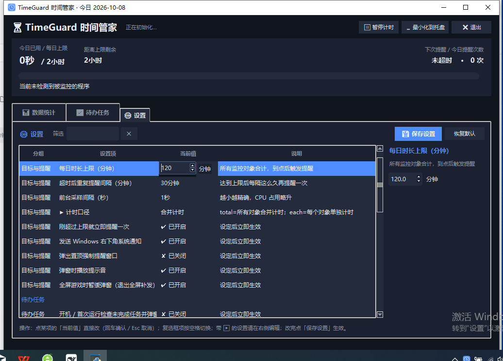 | 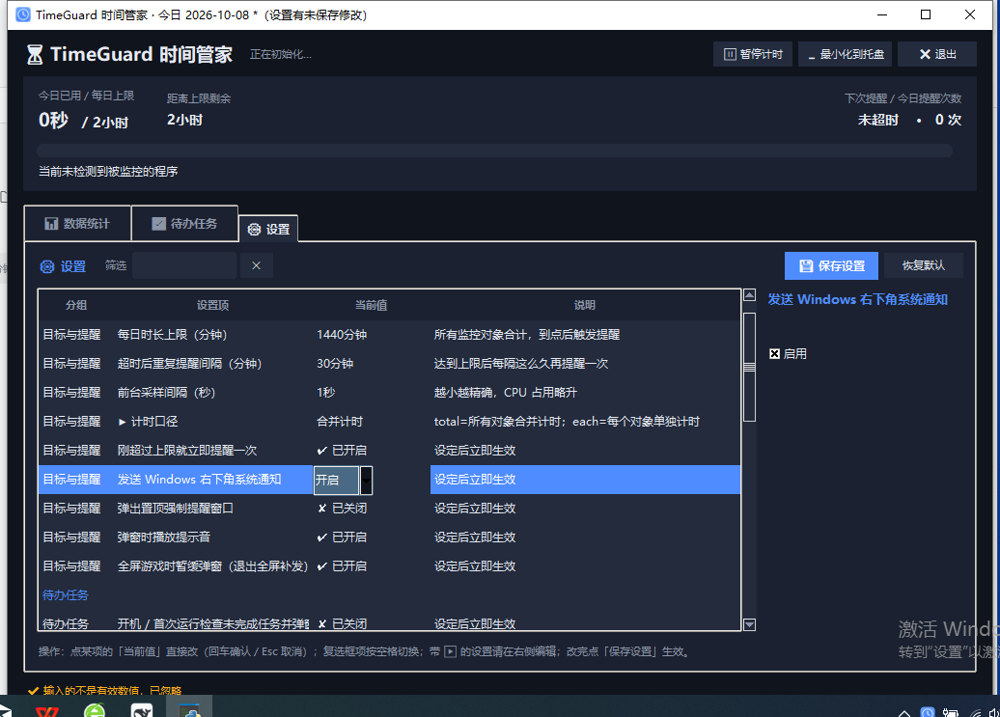 |

> 踩过的坑：就地编辑提交后，右侧面板里的同名控件仍持有**旧值**，
> 切行时会把旧值回写、覆盖用户刚改的值。所以提交后要先按新草稿重建面板控件
> （`_refresh_row_editors`），再渲染详情。

`tools\ui_smoke.py` 里固化了 `滚动残影检查`：按真实帧率（一帧一批 15 条滚轮消息）
连滚 10 帧，用抓图比对判断画面是否每帧都真的更新了（有陈旧帧就是残影）。

### 测试时不要把 Windows 通知中心塞满

开发与回归脚本会真的触发系统通知，跑几轮之后通知中心里就攒下一堆
「TimeGuard 待办提醒」气泡，看着像程序在乱弹。现在两头都堵上了：

* **默认不发真实通知**：所有 `tools/e2e_*.py` 与 `ui_smoke.py` 开头都会
  `os.environ.setdefault("TIMEGUARD_NO_TOAST", "1")`；`Notifier.notify()` 在测试模式下
  只把 `(标题, 内容)` 记进 `notifier.sent` 并返回成功，**不调用系统通知**。
  这样"到底请求过哪条通知"仍然可以断言（甚至比以前更准），但屏幕上不会弹东西。
  想验证真实气泡时把环境变量去掉再跑即可。
* **历史遗留一键清掉**：

  ```bat
  powershell -NoProfile -ExecutionPolicy Bypass -File tools\clear_toasts.ps1
  ```

  它按候选 AUMID（`Python` / `python.exe` / exe 完整路径 / `TimeGuard 时间管家` …）
  调用 `ToastNotificationManager.History.Clear()`，然后打开通知中心截一张图，
  方便确认真的清干净了。

### 长内容容器（仍在用）

`VerticalScrolledFrame`（`Canvas + create_window`）保留给"内容不多、可以滚动"的
场景使用，它已按 `after_idle` 合并滚轮事件，滚动本身不会延迟画面。
**设置页已不再使用它** —— 那里的内容太多，必须走表格自绘。

### 相似的开源项目（调研结论）
写这个项目之前调研了一圈同类工具，完整对比表（星数 / 语言 / 最后更新 / 许可证，数据直接查 GitHub API）
放在 [docs/RELATED.md](docs/RELATED.md)。一句话结论：

**"监控其它进程的用时 + 到每日上限强制弹窗 + 同一界面里带周期任务打卡"三件事一起做的开源项目很少。**

* 统计类（[ActivityWatch](https://github.com/ActivityWatch/activitywatch) 19.1k★、
  [ScreenTimeTracker](https://github.com/majianchuan/ScreenTimeTracker) 145★）**只记录、不干预**；
* 限制类（[Focuser](https://github.com/aadeshrao123/Focuser) 47★、
  [LeechBlock NG](https://github.com/proginosko/LeechBlockNG) 1.1k★）走的是**"拦住不让你进"**，
  而不是"到点了弹窗劝你休息"；
* 休息提醒类（[stretchly](https://github.com/hovancik/stretchly) 6.6k★、
  [Workrave](https://github.com/rcaelers/workrave) 1.8k★、
  [Safe Eyes](https://github.com/slgobinath/safeeyes) 1.8k★）按**固定周期**打断你，不在乎你实际用了多久；
* 待办类（[Super Productivity](https://github.com/super-productivity/super-productivity) 22.6k★、
  [Taskwarrior](https://github.com/GothenburgBitFactory/taskwarrior) 6.1k★、
  [Task Coach](https://github.com/taskcoach/taskcoach)）不监控别的程序。

最接近的两个近亲：[Focusd](https://github.com/0xarchit/Focusd)（Windows + 每日上限，Go）和
[Watcher](https://github.com/Waishnav/Watcher)（Python 极简屏幕时间统计，Linux）。

### 实机验证记录（Windows 10 + Python 3.14 + 7-Zip 26）

| 验证项 | 结果 |
| --- | --- |
| 单元测试（配置 / 数据库 / 匹配 / 计时 / 暂停 / 休眠丢弃 / 超限提醒 / 弹窗队列） | 22/22 通过，连跑 5 次稳定 |
| 环境自检 `--selftest` | 全部通过（前台窗口、进程名解析、匹配演练） |
| GUI 冒烟测试 | 通过，托盘图标启动、控件齐全、4 张截图正常 |
| 端到端超限提醒 | 累计 60.0s 时触发 1 次回调，通知 + 置顶弹窗出现在右下角 (872,438)-(1358,727) |
| PyInstaller 打包 exe | 成功，`--selftest` 退出码 0，GUI 启动日志完整 |
| 安装包 `TimeGuard-Setup.exe` | 全新环境实测：解压 → 安装 → 桌面快捷方式 / 开始菜单 / 开机自启 / 中文说明 全部生成 |
| 周期任务界面（阶段四） | `tools/e2e_phase4_ui.py`：47 项断言全通过 —— 三种重复周期都建得出且字段正确落库、每周不选星期被拦下、分组归属与「不重复进两组」、折叠状态跨刷新保留、打卡只写 `task_logs`、周期任务拒绝「延后」、编辑回填与类型切换清字段；5 张截图（`16`~`20`）人工确认排版无缺失/裁切 |
| 关闭方式与托盘（v1.4） | `tools/e2e_tray_close.py`：26 项断言全通过 —— 叉号弹二选一、选项文案写明后果、取消不关任何东西、选后台只收托盘不发退出通知、选退出才真退出、恢复后窗口在屏幕内（连测 3 轮）、托盘不可用时拒绝隐藏、**托盘提示只发一次且说明"以后不再自动提示"** |
| 设置页就地编辑（v1.4） | `tools/e2e_settings_inline.py`：21 项断言全通过 —— 整数不再显示成 `120.0`、编辑区保留单位「分钟」、浮层覆盖整个「当前值」单元格（数字与单位同一触发区）、点单位那侧也能进编辑、点「说明」列不弹框、非法输入被拒、超界被夹取、布尔项是「开启 / 关闭」下拉、空格快速翻转仍可用 |
| 开机提醒弹窗（v1.4） | `tools/e2e_startup_dialog.py`：17 项断言全通过 —— 大号 ✕（52×44px）能立刻关闭、倒计时从 5 秒递减、归零后自动关闭、同一天第二次启动不弹、换一天又能弹、托盘提示只发一次并写明"以后不再自动提示" |
| 周期任务生效起始日（v1.4） | `tools/e2e_start_date.py`：14 项断言全通过（真实对话框建任务）—— 21 点建「每天 20:33~21:33」→ 生效日是明天、今天不排班、列表落「本周待办」且不是"已超期"、今日统计与 7 天图表都不记逾期、调度器下一次唤醒在明天；建「每天 21:48~22:48」（还没到）→ 生效日就是今天、正常进「今日待办」 |
| GitHub Actions CI | 推上 GitHub 后自动跑（Python 3.11 + 3.13）：170 个单元测试 + `--selftest` + ruff 全部通过。**CI 上线第一天就抓出两个真问题**：① 用例里写死了 `2026-10-09`，到了这天"生效日晚于今天"不再成立，断言挂掉；② runner 是 en-US，stdout 走管道时用 cp1252 编码，脚本最后那行中文摘要抛 `UnicodeEncodeError` —— 测试全过但退出码 1。后者不只是 CI 问题：**任何英文系统的用户跑 `--selftest` 都会崩**。修法是新增 `utils.use_utf8_console()`（把 stdout/stderr 切到 UTF-8，`errors="replace"`），`main()` 与 5 个测试入口都调用 |
| 累计打卡任务（v1.5） | `tools/e2e_cumulative.py`：40 项断言全通过（真实对话框建任务 + 真实 Tk 控件）—— 切换类型时只显示打卡那一栏、目标/截止/提醒时间正确落库且周期字段留空、界面按钮打卡成功并变成"撤销"、同一天再打一次被拦下、45/60 进度与剩余天数正确、**截止日之前统计里没有"已超期"**、到点派发「该打卡了」、今天已打卡则顺延到明天、**攒够 60 次后连定时器都不再排**、截止日当天打满算「压哨完成」、`今天 > 截止日` 才算「逾期未达标」、过期后禁止打卡、打卡历史 60 条可按区间查、`complete_task()` 拒绝写坏累计任务；3 张截图（`26`~`28`）人工确认排版 |

---

## 七、许可证

[MIT](LICENSE) —— 随便用、随便改、可以商用，只要保留版权声明即可。

```
Copyright (c) 2026 31874951687
```

> 想换成别的（Apache-2.0 / GPL-3.0 / 保留所有权利）：直接替换根目录的 `LICENSE` 文件即可，
> 同时把上面这行和 README 顶部的 license 徽章一起改掉。

